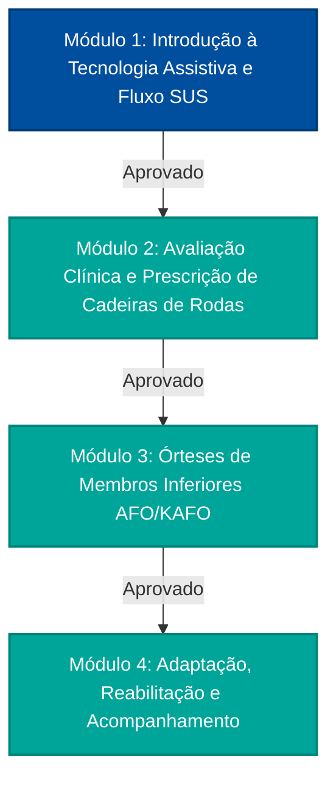

# SUSAssist: Solução para o Desafio de Educação Digital no SUS
## Tema: Capacitação Permanente em Tecnologia Assistiva (Órteses e Próteses)

Este documento apresenta a análise e a proposta de solução desenvolvida para o **Desafio 2: Educação Digital para Profissionais do SUS**, com foco na temática de **Tecnologia Assistiva (Órteses e Próteses - O&P)**, conforme as diretrizes do Edital do Hackathon Saúde Digital Unifesp 2026.

---

## 1. O Diagnóstico do Problema no SUS
A prescrição, dispensação, adaptação e acompanhamento de órteses e próteses no Sistema Único de Saúde enfrentam gargalos críticos:
1. **Centralização e Falta de Capacitação na Atenção Primária:** Profissionais das Unidades Básicas de Saúde (UBS) frequentemente não possuem formação específica para avaliar necessidades de tecnologia assistiva simples (como cadeiras de rodas de diferentes tipos, andadores, órteses de tornozelo-pé, etc.).
2. **Encaminhamentos Inadequados:** A falta de conhecimento técnico gera encaminhamentos incorretos ou incompletos aos Centros Especializados em Reabilitação (CER), sobrecarregando o sistema de média/alta complexidade e aumentando o tempo de espera nas filas.
3. **Abandono do Equipamento (Rejeição):** Dispositivos prescritos sem a correta adequação postural ou funcional acabam sendo abandonados pelo paciente, o que representa prejuízo clínico (piora da mobilidade, escaras, deformidades) e desperdício de recursos públicos.
4. **Tempo e Escala dos Profissionais:** Profissionais de saúde têm jornadas intensas e dificuldade em se afastar do trabalho para cursos tradicionais e longos.

---

## 2. A Solução Proposta: **SUSAssist**
O **SUSAssist** é uma plataforma digital de **microlearning adaptativo** e **apoio à decisão clínica**, disponível via Web e App Mobile (PWA), desenhada para capacitar profissionais de saúde diretamente em seu local de trabalho.

A plataforma baseia-se em quatro pilares fundamentais:

### A. Trilhas de Aprendizamento Adaptativas (Microlearning)
Em vez de cursos longos, o profissional realiza pílulas de conhecimento (módulos de 3 a 5 minutos) focadas em competências específicas. A trilha é adaptada de acordo com o papel do profissional (médico, fisioterapeuta, enfermeiro ou agente comunitário de saúde - ACS) e seu nível de conhecimento prévio, detectado por breves quizzes diagnósticos.

### B. Eva: Assistente Virtual de IA para Tecnologia Assistiva
A **Eva** (Especialista em Vida Assistiva) é uma inteligência artificial que atua de duas formas:
1. **Tutor de Aprendizado:** Acompanha o profissional na trilha, responde a dúvidas sobre conteúdos, sugere revisões e detalha materiais complexos.
2. **Suporte Clínico:** Serve como ferramenta de apoio no dia a dia da UBS. O médico ou fisioterapeuta pode perguntar à Eva sobre critérios de elegibilidade para próteses de membros inferiores, portarias do SUS (como a Portaria de Consolidação nº 2/2017) ou como medir adequadamente um paciente para prescrição de cadeira de rodas.

### C. Simulador de Casos Clínicos Interativos
O profissional aprende na prática por meio de cenários interativos simulados. Ele avalia pacientes fictícios com diferentes perfis sociais, funcionais e clínicos, devendo prescrever a tecnologia assistiva correta, configurar acessórios (como almofadas anti-escaras) e desenhar o fluxo de encaminhamento adequado no SUS.

### D. Gamificação e Micro-credenciamento (Badges)
Para estimular o engajamento, a plataforma conta com uma dinâmica de gamificação. À medida que o profissional avança nas trilhas de O&P e resolve casos clínicos com sucesso, ele desbloqueia medalhas de competência (*badges*), como:
* *Guardião da Postura* (prescrição correta de cadeira de rodas).
* *Mestre do Encaminhamento* (fluxo correto UBS -> CER).
* *Protetor da Pele* (prevenção de lesões por pressão).

---

## 3. Avaliação Frente aos Critérios do Edital (Pesos e Alinhamento)

### 3.1. Impacto Clínico/Social (Peso 30%)
* **Na vida do usuário do SUS:** A capacitação adequada da atenção primária acelera o diagnóstico e a prescrição correta da O&P. O paciente recebe um dispositivo adequado mais rapidamente, reduzindo complicações físicas (úlceras por pressão, contraturas e dores) e psicológicas. Promove diretamente a equidade e a autonomia de pessoas com deficiência.
* **Na qualidade do cuidado:** Aumenta a resolutividade na UBS, reduzindo a taxa de abandono do equipamento (que hoje chega a níveis alarmantes em algumas regiões por falta de adaptação correta).

### 3.2. Viabilidade Técnica (Peso 30%)
* **Integração com Sistemas Existentes:** 
  - **AVASUS/UNA-SUS:** O SUSAssist funciona como um microsserviço educacional integrado via LTI (Learning Tools Interoperability) ou APIs Rest às plataformas de capacitação oficiais do Ministério da Saúde.
  - **CNES e Gov.br:** Autenticação unificada via Gov.br para verificar a atuação do profissional no SUS pelo Cadastro Nacional de Estabelecimentos de Saúde (CNES).
  - **e-SUS APS:** Integração do simulador para que possa ser acessado como ferramenta de apoio à decisão clínica (DSS - Decision Support System) direto do prontuário eletrônico.
* **Exequibilidade:** O protótipo utiliza tecnologias web modernas (HTML, CSS e JavaScript) e pode ser implementado como um aplicativo híbrido leve, com baixos requisitos de servidor.

### 3.3. Segurança e LGPD (Peso 20%)
* **Tratamento de Dados de Saúde:** O simulador clínico utiliza apenas dados sintéticos (pacientes fictícios), eliminando riscos de vazamento de informações reais de pacientes.
* **Dados do Profissional:** O cadastro do profissional na trilha coleta dados restritos de identificação funcional (conforme as bases do Gov.br) com criptografia ponta a ponta (HTTPS/TLS) e controle de acessos estrito.
* **Consentimento:** Termo de Consentimento Livre e Esclarecido (TCLE) digital integrado para a coleta de dados de navegação e desempenho escolar, usados exclusivamente para a melhoria pedagógica das trilhas.

### 3.4. Escalabilidade (Peso 20%)
* **Diversidade de Contextos (UBS Rurais a CERs):** A aplicação é otimizada para funcionar em conexões lentas (3G/4G rural). O conteúdo teórico e os simuladores de texto ficam disponíveis em modo offline no PWA. Os dados de progresso são sincronizados automaticamente quando houver conexão disponível.
* **Adaptação Regional:** A trilha pode ser customizada para refletir os fluxos locais de cada município ou estado (já que os fluxos de referência e contrarreferência podem variar regionalmente no Brasil).

---

## 4. Estrutura da Trilha de Aprendizado no Protótipo
O protótipo interativo simula a jornada do profissional dividida em 4 marcos de competência:

1. **Módulo 1 - Fundamentos e Fluxo SUS:** Focado na diferença entre Órtese e Prótese, legislação (Diretrizes da Pessoa com Deficiência) e fluxo de referência (UBS -> CER).
2. **Módulo 2 - Prescrição de Cadeira de Rodas:** Medidas do paciente, escolha do modelo (padrão, monobloco, motorizada, postural) e prevenção de úlceras por pressão.
3. **Módulo 3 - Órteses MMII (AFO e KAFO):** Indicações para órteses de tornozelo-pé (AFO) e joelho-tornozelo-pé (KAFO) pós-AVC, paralisia cerebral e traumas.
4. **Módulo 4 - Reabilitação e Acompanhamento:** Processo de treino de marcha, acompanhamento pós-entrega, manutenção e descarte correto.

---

## 5. Diferencial para a Banca Avaliadora
* **Foco Centrado no Profissional e no Usuário Final:** A solução não é apenas teórica; ela treina o profissional com foco no bem-estar do usuário final (equidade e protagonismo do paciente).
* **Solução Prática vs Teórica:** O simulador garante que o profissional saiba aplicar a teoria imediatamente na sua rotina de atendimento na UBS.
* **Uso Inteligente de IA:** A IA não substitui o treinamento do profissional, mas sim o potencializa, servindo como uma "preceptora digital de bolso" 24 horas por dia.
